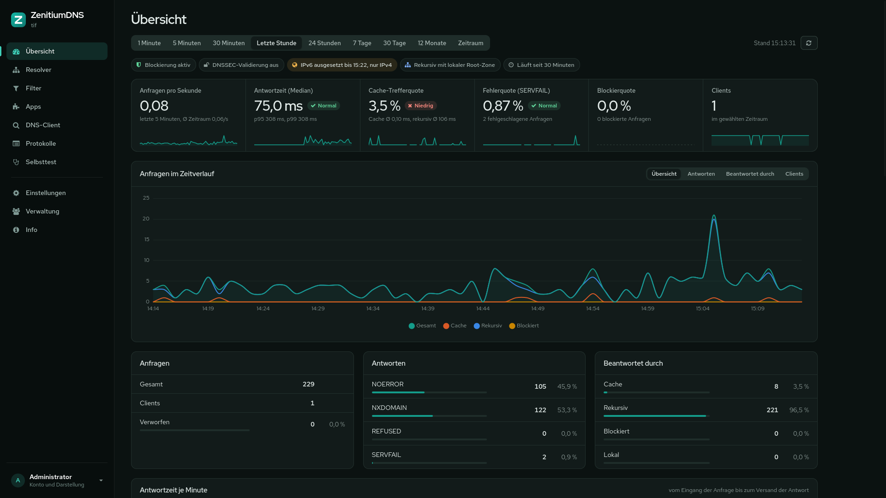

<p align="center">
	<br />
	<b>ZenitiumDNS</b><br />
	<br />
	<b>Eigener DNS-Server für Privatsphäre und Sicherheit</b><br />
	<b>Werbung und Schadsoftware im ganzen Netzwerk auf DNS-Ebene blockieren</b><br />
	<br />
	<a href="README.md">English</a> · <b>Deutsch</b>
</p>

<p align="center">
	
</p>

ZenitiumDNS ist ein quelloffener rekursiver DNS-Resolver, den du selbst betreiben kannst – als öffentlicher Resolver im Internet oder als zentraler Resolver im eigenen Netz. Er löst Namen selbst über die Root-Server auf oder leitet sie verschlüsselt an Forwarder weiter, blockiert Werbung und Schadsoftware auf DNS-Ebene und bringt eine Weboberfläche auf Deutsch oder Englisch mit Statistiken, Antwortzeiten und Protokollen mit.

Um die Namensauflösung kümmert sich kaum jemand, denn sie läuft automatisch im Hintergrund und ist schwer zu durchschauen. Die meisten Programme nutzen den DNS-Resolver des Betriebssystems, der wiederum per UDP den DNS-Server des Internetanbieters fragt. Das funktioniert, aber der Anbieter sieht und kontrolliert damit, welche Webseiten du aufrufst, auch wenn diese HTTPS verwenden. Manche Anbieter leiten Anfragen sogar um, blockieren sie oder verändern Inhalte. ZenitiumDNS nimmt Anfragen über UDP, TCP, [DNS-over-TLS](https://de.wikipedia.org/wiki/DNS_over_TLS), [DNS-over-HTTPS](https://de.wikipedia.org/wiki/DNS_over_HTTPS) und [DNS-over-QUIC](https://www.ietf.org/rfc/rfc9250.html) entgegen und löst sie als rekursiver Resolver direkt über die Root-Server auf, auf Wunsch mit DNSSEC-Validierung. Alternativ nutzt er Forwarder über dieselben verschlüsselten Protokolle.

Der Funktionsumfang ist auf den Betrieb als Resolver zugeschnitten. Autoritative Zonen, Zonentransfers, DHCP-Server, Clustering und die Windows-Komponenten des Originals sind entfernt. Für interne Domains gibt es Weiterleitungszonen (Conditional Forwarder), in denen sich einzelne Einträge lokal überschreiben lassen.

# Herkunft
ZenitiumDNS ist ein Fork von [Technitium DNS Server](https://github.com/TechnitiumSoftware/DnsServer) und [TechnitiumLibrary](https://github.com/TechnitiumSoftware/TechnitiumLibrary) von Shreyas Zare auf Basis von Version 15.5.1. Beide Projekte stehen unter der GNU General Public License v3.0, ebenso dieser Fork. Welche Änderungen der Fork enthält, steht in [NOTICE.de.md](NOTICE.de.md). Alle Unterschiede zum Original-Build mit Messwerten sind in [CHANGELOG-ZenitiumDNS.de.md](CHANGELOG-ZenitiumDNS.de.md) aufgeführt.

# Was ZenitiumDNS gegenüber dem Original bietet
- Auf öffentliche Resolver zugeschnitten: Autoritative Zonen (Primary, Secondary, Stub, Catalog), DNSSEC-Signierung, Zonentransfers, NOTIFY, dynamische Updates, TSIG, DHCP-Server, Clustering, Windows-Dienst, Systemtray und Windows-Installer sind entfernt. Das verkleinert Angriffsfläche und Weboberfläche.
- Anfragefilter nach dem Vorbild von dnsdist, standardmäßig aktiv: Anfragen, die auf einem öffentlichen Resolver nichts verloren haben (ANY, AXFR/IXFR, fremde Opcodes und Klassen, ohne RD-Flag, übergroß oder fehlerhaft), werden über UDP verworfen und über TCP, DoT, DoH und DoQ abgewiesen.
- Ratenbegrenzung in Anfragen pro Sekunde mit Token-Bucket je Client-Subnetz, CGNAT-taugliche Standardwerte und Client-Sperrlisten wie IPsum oder Spamhaus DROP, deren Adressen schon vor dem Auswerten der Anfrage verworfen werden.
- Lokale, vollständig geprüfte Kopie der Root-Zone und der arpa-Zone nach RFC 8806 mit ZONEMD-Prüfung: Delegationen kommen aus dem Speicher, nicht existierende Top-Level-Domains beantwortet der Resolver selbst. Die Root-Vertrauensanker werden signaturgeprüft von IANA übernommen. Alles lässt sich abschalten oder durch eigene, in der Weboberfläche bearbeitete Versionen ersetzen.
- Do53 wahlweise voll, nur für DDR (andere Anfragen verworfen oder abgelehnt) oder ganz abgeschaltet.
- Wächter, der bei vollem Datenträger, Speichermangel, überlaufenden Warteschlangen oder ausgefallenen Diensten selbst eingreift, dazu Echtzeitgraphen interner Prozesse.
- Selbsttest, der Dienste, Auflösung, DNSSEC, Zertifikate, Sicherheitseinstellungen, Listen und Systemgrenzen prüft und schwere Probleme auf der Übersicht meldet.
- PEM-Zertifikate wie `fullchain.pem` und `privkey.pem` ohne Umwandlung, automatische Ankündigung der verschlüsselten Dienste per DDR (RFC 9462). Der eigene Servername und die Namen im Zertifikat werden nie blockiert.
- Firefox-Canary und Chromes Preflight-Prüfung lassen sich per Schalter beantworten, damit Browser beim Resolver bleiben.
- DNSSEC-Validierung für den Post-Quantum-Algorithmus ML-DSA-44 mit Schutz vor Downgrades auf klassische Algorithmen.
- Eigenständiges Debian-13-Paket mit eingebauter .NET-Laufzeit, gehärtetem systemd-Dienst, zufälligem Admin-Passwort bei der Erstinstallation und vorinstallierten, standardmäßig deaktivierten Resolver-Apps, die sich über ein Formular oder direkt als JSON konfigurieren lassen.
- Weboberfläche wahlweise auf Deutsch oder Englisch, nach der Installation beim ersten Anmelden gewählt und jederzeit in den Einstellungen umstellbar. Selbsttest, Meldungen des Servers, App-Beschreibungen und die DoH-Startseite folgen der gewählten Sprache. Eigenes Design: Seitenleiste, Messwertleiste mit Verläufen, Einstellungen in thematischen Bereichen, Hell-, Dunkel- und Bernstein-Modus, auch auf dem Smartphone bedienbar.
- Antwortzeit-Statistik: Median, 95./99. Perzentil und Durchschnitt getrennt nach Cache und rekursiver Auflösung, als Live-Kennzahl und Verlauf.
- Automatischer IPv6-Rückfall: Ist IPv6 gestört, pausiert der Resolver ausgehende IPv6-Anfragen und nutzt IPv4, bis IPv6 wieder funktioniert.
- Keine Verbindungen zu Servern des Originalprojekts. Die Update-Prüfung fragt nur die Releases dieses Repositorys auf GitHub ab und zeigt Änderungen und Installationsbefehl an. Alle Apps werden mit dem Paket ausgeliefert, einen App-Store gibt es nicht.
- Robusterer rekursiver Resolver:
  - löst lange CNAME-Ketten und Nameserver ohne Glue-Einträge vollständig auf,
  - fällt bei Problemen mit dem Root-Priming auf die Root-Hints zurück,
  - bewertet Nameserver getrennt nach IPv4 und IPv6,
  - umgeht nicht erreichbare Adressen nach wenigen Anfragen.
- Deutlich effizientere Anfrageverarbeitung:
  - rund 70 % weniger CPU-Zeit pro Anfrage bei gleicher Last,
  - rund 65 % weniger Speicherallokationen,
  - keine minütlichen Hänger durch die Cache-Wartung.
- Deutlich weniger Speicherbedarf: 2,5 Millionen Domains aus Blocklisten belegen rund 80 statt 395 MB, und die Statistik behält von jeder abgeschlossenen Minute nur die Top 1000. Unter Last ist rund 70 % weniger Speicher belegt.
- Zusätzliche Fehler- und Sicherheitskorrekturen im Cache, in den Query-Log-Apps, der Weboberfläche und bei DNS-over-TCP/TLS.

# Funktionen

## Resolver
- Rekursive Auflösung direkt über die Root-Server oder Weiterleitung an Forwarder.
- Öffentliche Resolver wie Cloudflare, Google, Quad9 oder AdGuard lassen sich über [DNS-over-TLS](https://www.rfc-editor.org/rfc/rfc7858.html), [DNS-over-HTTPS](https://www.rfc-editor.org/rfc/rfc8484.html) oder [DNS-over-QUIC](https://www.ietf.org/rfc/rfc9250.html) als Forwarder nutzen.
- Latenzbasierte Auswahl der Nameserver mit paralleler Abfrage. Antwortzeit und Fehlerrate werden getrennt für IPv4 und IPv6 geführt.
- Automatischer IPv6-Rückfall bei gestörter IPv6-Anbindung mit Hintergrundprüfung und manueller Prüfung in der Weboberfläche.
- DNSSEC-Validierung mit RSA, ECDSA, EdDSA und ML-DSA-44 für rekursiven Resolver, Forwarder und Weiterleitungszonen, mit NSEC und NSEC3.
- QNAME-Minimierung ([RFC 9156](https://www.rfc-editor.org/rfc/rfc9156.html)).
- Zufällige Groß-/Kleinschreibung des QNAME bei UDP ([draft-vixie-dnsext-dns0x20-00](https://datatracker.ietf.org/doc/html/draft-vixie-dnsext-dns0x20-00)). Abweichende Antworten gelten als Spoofing-Versuch und werden sofort über TCP wiederholt.
- EDNS(0) ([RFC 6891](https://datatracker.ietf.org/doc/html/rfc6891)), EDNS Client Subnet ([RFC 7871](https://datatracker.ietf.org/doc/html/rfc7871)) und Extended DNS Errors ([RFC 8914](https://datatracker.ietf.org/doc/html/rfc8914)).
- Lokal bereitgestellte Zonen ([RFC 6303](https://www.rfc-editor.org/rfc/rfc6303)) und Domainnamen für besondere Zwecke ([RFC 6761](https://www.rfc-editor.org/rfc/rfc6761)).
- DNS64 ([RFC 6147](https://www.rfc-editor.org/rfc/rfc6147)) für reine IPv6-Clients über die DNS64 App.
- Weiterleitungszonen (Conditional Forwarder) für interne Domains, mit Zugriffsbeschränkung pro Zone und lokal überschreibbaren Einträgen (A, AAAA, CNAME, MX, TXT, SRV, SVCB/HTTPS, CAA, ANAME, FWD, APP u. a.).
- Negative Trust Anchors über Weiterleitungszonen mit abgeschalteter DNSSEC-Validierung.
- Conditional Forwarding in großer Zahl über die Advanced Forwarding App.

## Cache
- Umfangreicher Cache mit Serve Stale ([RFC 8767](https://www.rfc-editor.org/rfc/rfc8767)) und Prefetch.
- Der Cache wird beim Beenden gespeichert und beim Start wieder geladen.
- Cache-Ansicht mit Nameserver-Statistik je Adressfamilie in der Weboberfläche.

## Schutz und Filter
- Blockiert Werbung und Schadsoftware über eine oder mehrere Blocklisten-URLs, manuell blockierte Domains und Ausnahmen über erlaubte Domains. Die Schnellauswahl bietet die Listen von HaGeZi vom Build-Mirror, eigene Blockierungstexte und eine eigene TTL für negatives Caching sind einstellbar.
- Erkennung von CNAME-Cloaking: Domains, die per CNAME auf blockierte Domains verweisen, werden ebenfalls blockiert.
- Blocklisten mit regulären Ausdrücken und unterschiedlichen Listen je Client-IP-Adresse oder Subnetz über die Advanced Blocking App.
- Schutz vor DNS-Rebinding-Angriffen mit der DNS Rebinding Protection App.
- Anfragefilter für ungewöhnliche Anfragen mit Trefferzählern je Regel.
- Zugriffssteuerung für die Rekursion per Netzwerk-ACL.
- Ratenbegrenzung pro Client-Subnetz in Anfragen pro Sekunde mit Burst und Ausnahmeliste.
- Client-Sperrlisten für IP-Adressen und Netze, automatisch aktualisiert.

## Protokolle
- Eigene Dienste für [DNS-over-TLS](https://www.rfc-editor.org/rfc/rfc7858.html), [DNS-over-HTTPS](https://www.rfc-editor.org/rfc/rfc8484.html) (HTTP/1.1, HTTP/2 und HTTP/3) und [DNS-over-QUIC](https://www.ietf.org/rfc/rfc9250.html).
- DNS über das [PROXY-Protokoll](https://www.haproxy.org/download/1.8/doc/proxy-protocol.txt) in Version 1 und 2 für UDP und TCP, z. B. hinter einem Load Balancer.
- Bearbeitung von Anfragen außer der Reihe für DNS-over-TCP und DNS-over-TLS ([RFC 7766](https://www.rfc-editor.org/rfc/rfc7766#section-7)) mit einstellbarer Obergrenze pro Verbindung.
- EDNS-Padding ([RFC 7830](https://www.rfc-editor.org/rfc/rfc7830), [RFC 8467](https://www.rfc-editor.org/rfc/rfc8467)) für DoT, DoH und DoQ, damit die Paketgröße nicht verrät, welche Domain abgefragt wurde.
- HTTP- und SOCKS5-Proxys für ausgehende Anfragen, etwa über das [Tor-Netzwerk](https://www.torproject.org/).

## Betrieb und Überwachung
- Übersicht mit Anfragen pro Sekunde, Antwortzeiten (Median, 95./99. Perzentil), Cache-Trefferquote, Fehler- und Blockierquote, Verlauf und Top-Listen.
- Statistik von einer Minute bis zwölf Monaten und Echtzeitgraphen interner Prozesse.
- Eingebaute System- und Anfrageprotokollierung, auf Wunsch ohne Client-Adressen, sowie Export der Anfrageprotokolle in SQLite, MySQL, PostgreSQL oder SQL Server über Apps.
- Hohe Performance: dedizierte UDP-Empfangs-Threads beantworten Cache-Treffer ohne Thread-Wechsel. In Tests auf einem Rechner mit 20 Kernen wurden über 700.000 Anfragen pro Sekunde beantwortet.
- Weboberfläche zur Konfiguration im Browser, auf Deutsch oder Englisch, mit Dunkelmodus.
- Mehrbenutzerbetrieb mit Rollen, Zwei-Faktor-Authentifizierung (2FA) per TOTP, Single Sign-On mit OpenID Connect und Anmeldung über LDAP.
- Eingebauter DNS-Client zum Testen von Auflösungen.
- Läuft unter Linux (Debian-Paket) und überall, wo .NET 10 verfügbar ist.
- Quelloffene, plattformübergreifende Umsetzung mit .NET 10.

# Aufbau des Repositorys
| Pfad | Inhalt |
| ---- | ------ |
| `src/ZenitiumDns` | Plattformübergreifender Server-Host (`ZenitiumDns.dll`) mit den Linux-Installationsskripten und Dienstdefinitionen. |
| `src/ZenitiumDns.Core` | DNS-Server, Webdienst, HTTP-API und Weboberfläche (`www`, englisches Wörterbuch in `www/lang/en.json`). |
| `src/ZenitiumDns.ApplicationCommon` | Schnittstellen für die Entwicklung von DNS-Apps und die gemeinsame Sprachauswahl. |
| `src/ZenitiumLibrary*` | Gemeinsame Bibliothek für DNS-Protokoll, Netzwerk, Ein-/Ausgabe und Sicherheit. |
| `apps` | Mitgelieferte DNS-Apps. |
| `setup/debian` | Build-Skript für das Debian-Paket, systemd-Dienst und Maintainer-Skripte. |
| `tools` | Hilfsskripte, etwa `i18n.py` zum Prüfen des englischen Wörterbuchs der Weboberfläche. |
| `docs` | Build-Anleitung, API-Dokumentation und Übersicht der Umgebungsvariablen. |

# Schnellstart
Fertige Debian-13-Pakete für amd64 und arm64 gibt es unter [Releases](https://github.com/DNSBunker/ZenitiumDNS/releases):

```
sudo apt install ./zenitiumdns_15.5.1-6_amd64.deb
```

Server mit dem [.NET 10 SDK](https://dotnet.microsoft.com/download) bauen und starten:

```
dotnet publish src/ZenitiumDns/ZenitiumDns.csproj -c Release -o publish
dotnet publish/ZenitiumDns.dll
```

Oder das Debian-13-Paket bauen und installieren:

```
setup/debian/build-deb.sh
sudo apt install ./setup/debian/dist/zenitiumdns_*.deb
```

Anschließend im Browser `http://<IP-Adresse-des-Servers>:5380/` öffnen, um die Weboberfläche aufzurufen. Nach der ersten Anmeldung wählst du die Sprache der Oberfläche.

# Übersetzung der Weboberfläche
Die Weboberfläche ist auf Deutsch geschrieben; `src/ZenitiumDns.Core/www/lang/en.json` ordnet jedem deutschen Text die englische Fassung zu. Statische Texte in `index.html` werden beim Laden der Seite übersetzt, in JavaScript erzeugte Texte laufen über `tr("…")` mit `{0}`, `{1}` … als Platzhaltern. Texte auf dem Server verwenden `Lang.T("Deutsch", "English")`. Nach dem Ändern oder Ergänzen von Texten zeigen

```
python3 tools/i18n.py missing
python3 tools/i18n.py check
```

fehlende Übersetzungen an und prüfen, ob Markup und Platzhalter übereinstimmen. `python3 tools/i18n.py sort` entfernt ungenutzte Einträge und sortiert das Wörterbuch.

# Dokumentation
- [Quellcode und Releases](https://github.com/DNSBunker/ZenitiumDNS)
- [Build-Anleitung](docs/BUILD.de.md)
- [Debian-Paket](setup/debian/README.Debian.de.md)
- [Umgebungsvariablen](docs/EnvironmentVariables.de.md)
- [Unterstützte RFCs](docs/SupportedRFCs.de.md)
- [Änderungsprotokoll](CHANGELOG.de.md)
- [Unterschiede zum Original-Build](CHANGELOG-ZenitiumDNS.de.md)

# Lizenz
ZenitiumDNS ist freie Software unter der [GNU General Public License v3.0](LICENSE).
