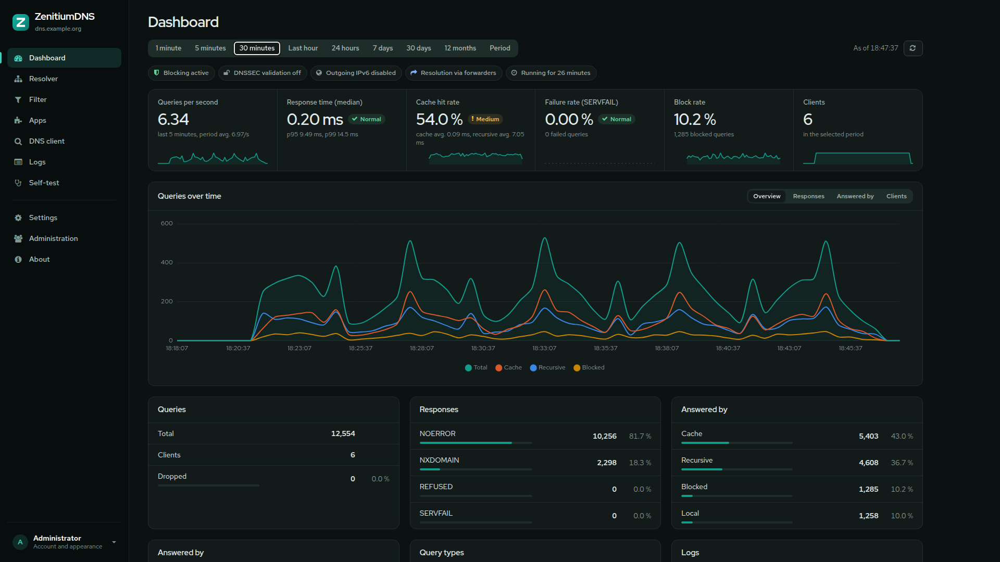

<p align="center">
	<br />
	<b>ZenitiumDNS</b><br />
	<br />
	<b>Your own DNS server for privacy and security</b><br />
	<b>Block ads and malware for your whole network at the DNS level</b><br />
	<br />
	<b>English</b> · <a href="README.de.md">Deutsch</a>
</p>

<p align="center">
	
</p>

ZenitiumDNS is an open source recursive DNS resolver that you run yourself – as a public resolver on the internet or as the central resolver of your own network. It resolves names itself via the root servers or forwards them encrypted to forwarders, blocks ads and malware at the DNS level and comes with a web interface in English or German with statistics, response times and logs.

Hardly anyone pays attention to name resolution, because it runs automatically in the background and is hard to see through. Most programs use the operating system's resolver, which in turn asks your provider's DNS server over UDP. That works, but it lets the provider see and control which websites you visit, even if they use HTTPS. Some providers even redirect, block or alter queries. ZenitiumDNS accepts queries over UDP, TCP, [DNS-over-TLS](https://en.wikipedia.org/wiki/DNS_over_TLS), [DNS-over-HTTPS](https://en.wikipedia.org/wiki/DNS_over_HTTPS) and [DNS-over-QUIC](https://www.ietf.org/rfc/rfc9250.html) and resolves them as a recursive resolver directly via the root servers, with DNSSEC validation if desired. Alternatively it uses forwarders over the same encrypted protocols.

The feature set is tailored to running a resolver. Authoritative zones, zone transfers, the DHCP server, clustering and the Windows components of the original are removed. For internal domains there are forwarder zones (conditional forwarders), in which individual records can be overridden locally.

# Origin
ZenitiumDNS is a fork of [Technitium DNS Server](https://github.com/TechnitiumSoftware/DnsServer) and [TechnitiumLibrary](https://github.com/TechnitiumSoftware/TechnitiumLibrary) by Shreyas Zare, based on version 15.5.1. Both projects are licensed under the GNU General Public License v3.0, and so is this fork. The changes the fork contains are listed in [NOTICE.md](NOTICE.md). All differences from the original build, including measurements, are listed in [CHANGELOG-ZenitiumDNS.md](CHANGELOG-ZenitiumDNS.md).

# What ZenitiumDNS offers compared to the original
- Tailored to public resolvers: authoritative zones (primary, secondary, stub, catalog), DNSSEC signing, zone transfers, NOTIFY, dynamic updates, TSIG, DHCP server, clustering, Windows service, system tray and Windows installer are removed. This reduces the attack surface and the web interface.
- Request filter modeled after dnsdist, active by default: queries that have no business on a public resolver (ANY, AXFR/IXFR, foreign opcodes and classes, without RD flag, oversized or malformed) are dropped over UDP and refused over TCP, DoT, DoH and DoQ.
- Rate limiting in queries per second with a token bucket per client subnet, CGNAT-friendly defaults and client block lists such as IPsum or Spamhaus DROP whose addresses are dropped even before the query is parsed.
- Local, fully verified copy of the root zone and the arpa zone according to RFC 8806 with ZONEMD verification: delegations come from memory, and the resolver answers nonexistent top-level domains itself. The root trust anchors are taken from IANA with signature verification. Everything can be turned off or replaced by custom versions edited in the web interface.
- Do53 either fully enabled, DDR only (other queries dropped or refused) or turned off completely.
- Watchdog that intervenes by itself on a full disk, memory pressure, overflowing queues or failed services, plus live graphs of internal processes.
- Self-test that checks services, resolution, DNSSEC, certificates, security settings, lists and system limits and reports serious problems on the dashboard.
- PEM certificates such as `fullchain.pem` and `privkey.pem` without conversion, automatic announcement of the encrypted services via DDR (RFC 9462). The server's own name and the names in the certificate are never blocked.
- Firefox's canary domain and Chrome's preflight check can be answered with a switch so that browsers stay with the resolver.
- DNSSEC validation for the post-quantum algorithm ML-DSA-44 with protection against downgrades to classic algorithms.
- Standalone Debian 13 package with bundled .NET runtime, hardened systemd service, random admin password on first installation and preinstalled resolver apps, disabled by default, that can be configured via a form or directly as JSON.
- Web interface in English or German, chosen at the first sign-in after installation and switchable at any time in the settings. Self-test, server messages, app descriptions and the DoH landing page follow the chosen language. Custom design: sidebar, metrics band with trends, settings grouped by topic, light, dark and amber mode, also usable on a smartphone.
- Response time statistics: median, 95th/99th percentile and average, separately for cache and recursive resolution, as live metric and history.
- Automatic IPv6 fallback: if IPv6 is broken, the resolver pauses outgoing IPv6 queries and uses IPv4 until IPv6 works again.
- No connections to servers of the original project. The update check only queries the releases of this repository on GitHub and shows the changes and the install command. All apps ship with the package; there is no app store.
- More robust recursive resolver:
  - fully resolves long CNAME chains and name servers without glue records,
  - falls back to the root hints on root priming problems,
  - rates name servers separately for IPv4 and IPv6,
  - bypasses unreachable addresses after a few queries.
- Much more efficient query processing:
  - about 70 % less CPU time per query under the same load,
  - about 65 % fewer memory allocations,
  - no minute-by-minute stalls caused by cache maintenance.
- Much lower memory use: 2.5 million block list domains take about 80 instead of 395 MB, and the statistics keep only the top 1,000 entries of every completed minute. Under load, about 70 % less memory is in use.
- Additional bug and security fixes in the cache, the query log apps, the web interface and DNS-over-TCP/TLS.

# Features

## Resolver
- Recursive resolution directly via the root servers or forwarding to forwarders.
- Public resolvers such as Cloudflare, Google, Quad9 or AdGuard can be used as forwarders over [DNS-over-TLS](https://www.rfc-editor.org/rfc/rfc7858.html), [DNS-over-HTTPS](https://www.rfc-editor.org/rfc/rfc8484.html) or [DNS-over-QUIC](https://www.ietf.org/rfc/rfc9250.html).
- Latency-based name server selection with parallel queries. Response time and error rate are tracked separately for IPv4 and IPv6.
- Automatic IPv6 fallback when IPv6 connectivity is broken, with background checks and a manual check in the web interface.
- DNSSEC validation with RSA, ECDSA, EdDSA and ML-DSA-44 for the recursive resolver, forwarders and forwarder zones, with NSEC and NSEC3. Validated NSEC and NSEC3 records are used aggressively according to RFC 8198: queries for names and types that do not exist in signed zones are answered from the cache, which also slows down attacks with random subdomains.
- QNAME minimization ([RFC 9156](https://www.rfc-editor.org/rfc/rfc9156.html)).
- Random letter case of the QNAME over UDP ([draft-vixie-dnsext-dns0x20-00](https://datatracker.ietf.org/doc/html/draft-vixie-dnsext-dns0x20-00)). Mismatching answers are treated as spoofing attempts and immediately retried over TCP.
- EDNS(0) ([RFC 6891](https://datatracker.ietf.org/doc/html/rfc6891)), EDNS Client Subnet ([RFC 7871](https://datatracker.ietf.org/doc/html/rfc7871)) and Extended DNS Errors ([RFC 8914](https://datatracker.ietf.org/doc/html/rfc8914)).
- Locally served zones ([RFC 6303](https://www.rfc-editor.org/rfc/rfc6303)) and special-use domain names ([RFC 6761](https://www.rfc-editor.org/rfc/rfc6761)).
- DNS64 ([RFC 6147](https://www.rfc-editor.org/rfc/rfc6147)) for IPv6-only clients via the DNS64 app.
- Forwarder zones (conditional forwarders) for internal domains, with per-zone access restriction and locally overridable records (A, AAAA, CNAME, MX, TXT, SRV, SVCB/HTTPS, CAA, ANAME, FWD, APP and more).
- Negative trust anchors via forwarder zones with DNSSEC validation turned off.
- Conditional forwarding at scale via the Advanced Forwarding app.

## Cache
- Comprehensive cache with serve stale ([RFC 8767](https://www.rfc-editor.org/rfc/rfc8767)) and prefetch.
- The cache is saved on shutdown and loaded again on start.
- Cache view with name server statistics per address family in the web interface.

## Protection and filtering
- Blocks ads and malware via one or more block list URLs, manually blocked domains and exceptions via allowed domains. The quick selection offers HaGeZi's lists from the build mirror; custom blocking texts and a custom TTL for negative caching can be configured.
- CNAME cloaking detection: domains that point to blocked domains via CNAME are blocked as well.
- Block lists with regular expressions and different lists per client IP address or subnet via the Advanced Blocking app.
- Protection against DNS rebinding attacks with the DNS Rebinding Protection app.
- Request filter for unusual queries with hit counters per rule.
- Access control for recursion via network ACL.
- Rate limiting per client subnet in queries per second with burst and exception list.
- Client block lists for IP addresses and networks, updated automatically.

## Protocols
- Own services for [DNS-over-TLS](https://www.rfc-editor.org/rfc/rfc7858.html), [DNS-over-HTTPS](https://www.rfc-editor.org/rfc/rfc8484.html) (HTTP/1.1, HTTP/2 and HTTP/3) and [DNS-over-QUIC](https://www.ietf.org/rfc/rfc9250.html).
- DNS over the [PROXY protocol](https://www.haproxy.org/download/1.8/doc/proxy-protocol.txt) version 1 and 2 for UDP and TCP, e.g. behind a load balancer.
- Out-of-order query processing for DNS-over-TCP and DNS-over-TLS ([RFC 7766](https://www.rfc-editor.org/rfc/rfc7766#section-7)) with a configurable limit per connection.
- EDNS padding ([RFC 7830](https://www.rfc-editor.org/rfc/rfc7830), [RFC 8467](https://www.rfc-editor.org/rfc/rfc8467)) for DoT, DoH and DoQ so that the packet size does not reveal which domain was queried.
- HTTP and SOCKS5 proxies for outgoing queries, for example via the [Tor network](https://www.torproject.org/).

## Operation and monitoring
- Dashboard with queries per second, response times (median, 95th/99th percentile), cache hit rate, failure and block rate, history and top lists.
- Statistics from one minute to twelve months and live graphs of internal processes.
- Built-in server and query logging, optionally without client addresses, and export of query logs to SQLite, MySQL, PostgreSQL or SQL Server via apps.
- High performance: dedicated UDP receive threads answer cache hits without thread switches. In tests on a machine with 20 cores, more than 700,000 queries per second were answered.
- Web interface for configuration in the browser, in English or German, with dark mode.
- Multi-user operation with roles, two-factor authentication (2FA) via TOTP, single sign-on with OpenID Connect and sign-in via LDAP.
- Built-in DNS client for testing resolutions.
- Runs on Linux (Debian package) and anywhere .NET 10 is available.
- Open source, cross-platform implementation with .NET 10.

# Repository layout
| Path | Content |
| ---- | ------- |
| `src/ZenitiumDns` | Cross-platform server host (`ZenitiumDns.dll`) with the Linux installation scripts and service definitions. |
| `src/ZenitiumDns.Core` | DNS server, web service, HTTP API and web interface (`www`, English dictionary in `www/lang/en.json`). |
| `src/ZenitiumDns.ApplicationCommon` | Interfaces for developing DNS apps and the shared language helper. |
| `src/ZenitiumLibrary*` | Shared library for the DNS protocol, networking, I/O and security. |
| `apps` | Bundled DNS apps. |
| `setup/debian` | Build script for the Debian package, systemd service and maintainer scripts. |
| `Containerfile`, `setup/container` | Container image and its entry point; `.github/workflows/container.yml` builds the image for every release. |
| `tools` | Helper scripts, e.g. `i18n.py` to check the English dictionary of the web interface. |
| `docs` | Build instructions, API documentation and overview of the environment variables. |

# Quick start
Ready-made Debian 13 packages for amd64 and arm64 are available under [Releases](https://github.com/DNSBunker/ZenitiumDNS/releases):

```
sudo apt install ./zenitiumdns_15.5.1-9_amd64.deb
```

The container image for amd64 and arm64 runs with Podman and Docker, see [Container image](docs/Container.md):

```
podman run -d --name zenitiumdns -p 53:53/udp -p 53:53/tcp -p 5380:5380/tcp -v zenitiumdns-config:/etc/zenitiumdns ghcr.io/dnsbunker/zenitiumdns:latest
```

Build and start the server with the [.NET 10 SDK](https://dotnet.microsoft.com/download):

```
dotnet publish src/ZenitiumDns/ZenitiumDns.csproj -c Release -o publish
dotnet publish/ZenitiumDns.dll
```

Or build and install the Debian 13 package:

```
setup/debian/build-deb.sh
sudo apt install ./setup/debian/dist/zenitiumdns_*.deb
```

Then open `http://<server-ip-address>:5380/` in your browser to access the web interface. After the first sign-in you choose the interface language.

# Translating the web interface
The web interface is written in German; `src/ZenitiumDns.Core/www/lang/en.json` maps every German text to English. Static texts in `index.html` are translated when the page loads, texts built in JavaScript go through `tr("…")`, with `{0}`, `{1}` … as placeholders. Server-side texts use `Lang.T("German", "English")`. After changing or adding texts, run

```
python3 tools/i18n.py missing
python3 tools/i18n.py check
```

to list missing translations and to verify that markup and placeholders match. `python3 tools/i18n.py sort` removes unused entries and sorts the dictionary.

# Documentation
- [Source code and releases](https://github.com/DNSBunker/ZenitiumDNS)
- [Build instructions](docs/BUILD.md)
- [Debian package](setup/debian/README.Debian.md)
- [Container image](docs/Container.md)
- [Environment variables](docs/EnvironmentVariables.md)
- [Supported RFCs](docs/SupportedRFCs.md)
- [Changelog](CHANGELOG.md)
- [Differences from the original build](CHANGELOG-ZenitiumDNS.md)

# License
ZenitiumDNS is free software licensed under the [GNU General Public License v3.0](LICENSE).
